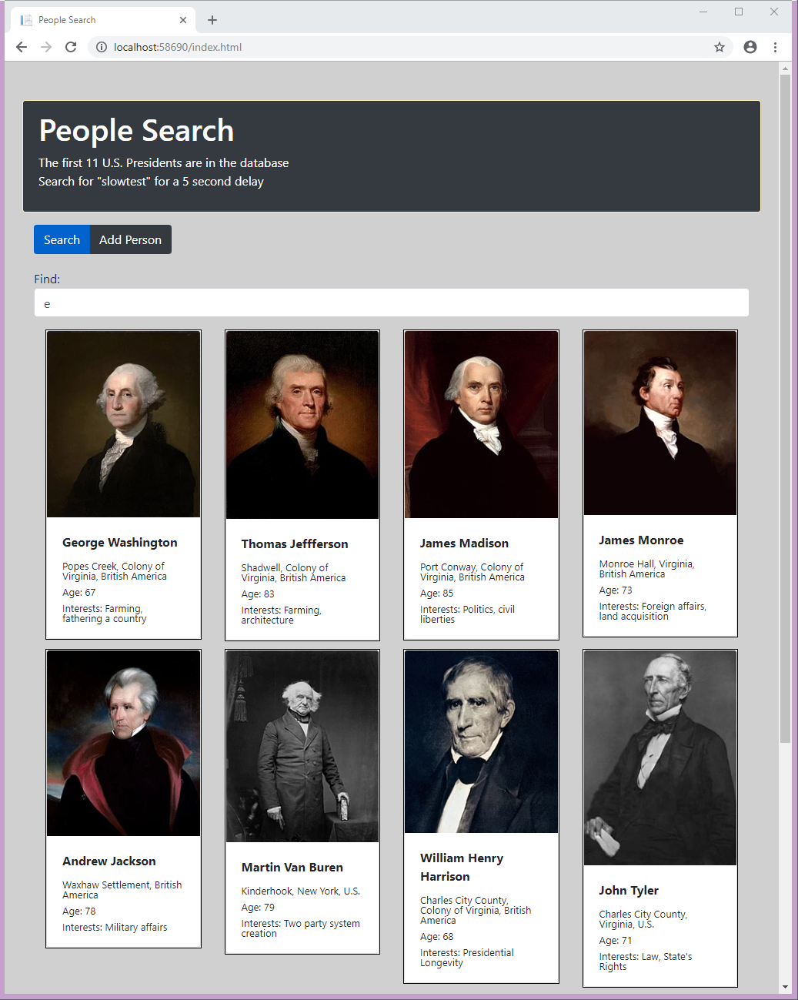

# full-stack-demo

This repo contains the code for a simple demonstration full stack application.  The technical components are:

- ASP.NET WebAPI
- Entity Framework Code First
- AutoMapper 
- React 
- TypeScript
- Bootstrap

I wanted to keep this demonstration as simple as possible, so I didn't use WebPack, didn't worry about minimizing and bundling JavaScript files, and didn't use a JavaScript module loader system like RequireJS.  

## The demonstration
The demo app starts with the first 11 U.S. presidents preloaded in a database.  When you type in the search bar, all presidents that have the search string in either their first or last names will be shown.  You can also add new presidents using the secondary tab.

 
## Author
* **Greg Sommerville** - *Initial work* 
 
## License
This project is licensed under the Apache 2.0 License - see the [LICENSE.md](LICENSE.md) file for details